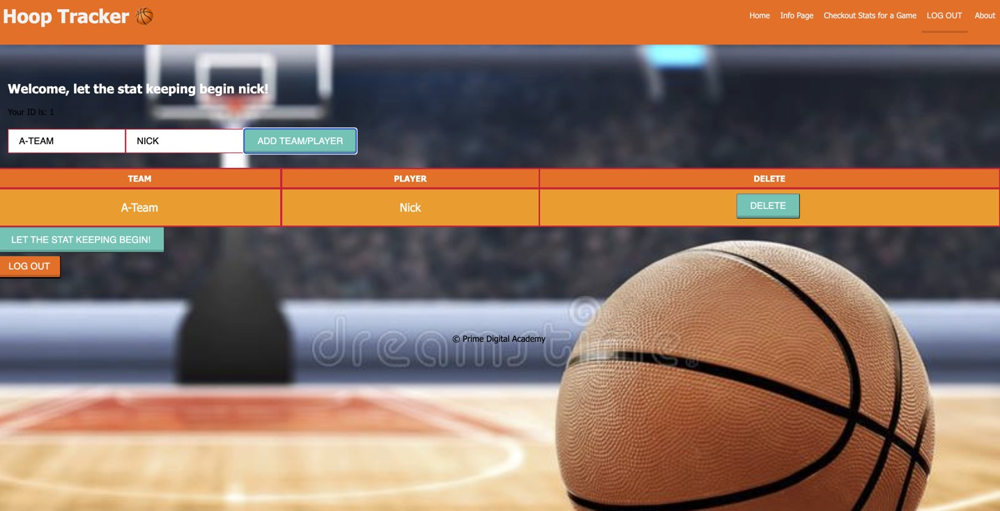

# Hoop Tracker Solo Project

## Table of Contents

- [Description](#description)
- [Screenshots](#screenshots)
- [Built With](#built-with)
- [Installation](#installation)
- [Usage](#usage)
- [Acknowledgements](#acknowledgements)
- [Contacts/Support](#contacts)

## Description

Hoop tracker is an app to help someone keep stats for a basketball game. I came up with the idea while playing in a league for the last 7 years. Our team can never remember what we scored a few games in the past. I thought that this app could help with that. 

## Screenshots

## Built With

### Installation

1. The project is built on Postgres, so you will need to make sure to have that installed. We recommend using Postico to run those queries as that was used to create the queries.
2. Create a data base named "hoop_tracker".
3. The SQL queries are in the database.sql file. Please copy and paste in the DB. It will create what is needed. 
4. Open up your editor of choice and run an npm install.
5. Run npm run server in your terminal.
6. Run npm run client in your terminal.
7. The npm run client command will open up a new browser tab for you.
8. Enjoy the Hoop Tracker! 

## Usage

1. Once the installation is complete Hoop Tracker will be up and running. 
2. Register a for a Username. 
3. Once logged in the first page will allow for a team and player name to be added. Once added the team and players will be listed on the same page. 
4. Those players can be deleted if needed at this point. 
5. Once everyone is added click on the "let the stat keeping begin!" button.
6. This will navigate you to the stat keeping page. Pick the date the game is bring played, choose the court and click on the stat buttons. The buttons will indicate a counter on them so you know the stat was recorded. 
6. Once the game is finished please, there is a comment section where any notes can be taken about the game. 
7. Once that is done, click the "Submit the game" button. This will submit all the stats and bring you to the page to review all the stats. 
8. The review the stats for a single game please use the drop down and select the date the game was played.
9. If stat for that game needed to be edited, click the Edit icon and this will allow to edit all the stats and the comments. 
10. This is Hoop Tracker! 

## Acknowledgements

I want to thank my instructor Matt Black and the staff at Prime Digital Academy. Also, my Gemini cohort mates for being so supportive and knowledgeable . last but not least thank you to my Wife for always having my back and being my biggest fan. 

## Contacts / Support

If you have suggestions or issues, please email me at Nick.Ilacqua@yahoo.com. 